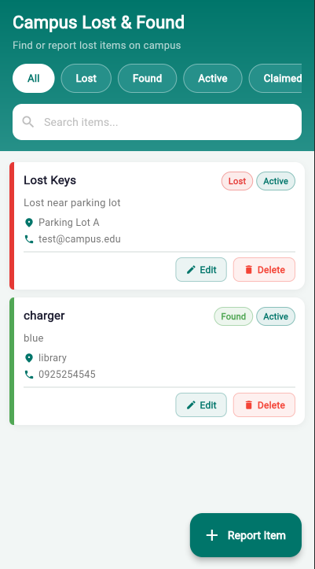
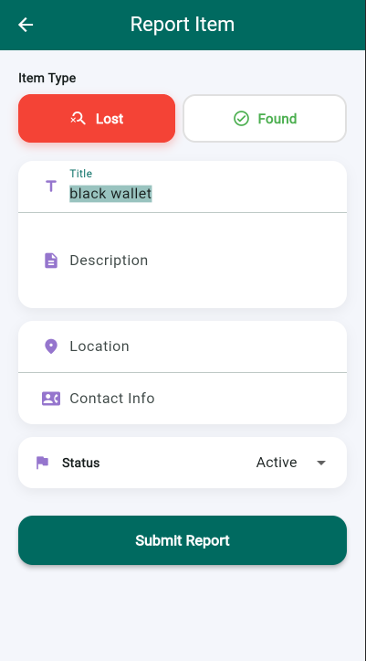
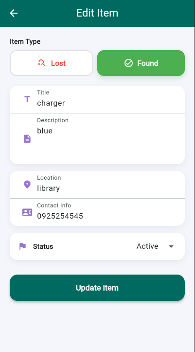
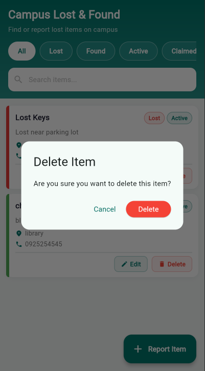

# Campus Lost & Found

**Name:** Zenebu Melaku | **ID:** UGR/6058/16 | **Section:** 2
**Course:** Mobile Application Development 2026

A Flutter app to report, browse, update, and delete lost & found items using a live public REST API.

---

## API
**Base URL:** `https://6a083b81fa9b27c848fac459.mockapi.io/items`

| Operation | Method | Endpoint |
|---|---|---|
| Read all | `GET` | `/items` |
| Create | `POST` | `/items` |
| Update | `PUT` | `/items/:id` |
| Delete | `DELETE` | `/items/:id` |

---

## Project Structure
```
lib/
├── main.dart
├── models/item_model.dart
├── providers/item_provider.dart
├── screens/
│   ├── home_screen.dart
│   └── add_edit_item_screen.dart
├── services/api_service.dart
└── widgets/
    ├── item_card.dart
    └── status_badge.dart
```

---

## Requirements

| Requirement | Implementation |
|---|---|
| Flutter app performing CRUD operations | Create, Read, Update, Delete via `mockapi.io` |
| Publicly available API | `https://6a083b81fa9b27c848fac459.mockapi.io/items` |
| Provider state management | `ItemProvider` extends `ChangeNotifier`, wrapped in `MultiProvider` |
| `http` package for network requests | All API calls use `package:http/http.dart` in `api_service.dart` |
| Clean & maintainable project structure | Separated into `models/`, `providers/`, `screens/`, `services/`, `widgets/` |
| Error handling & loading states | Try/catch on every call, error UI with retry, `isLoading` flag with spinner |

---

## Screenshots

| Home | Add | Edit | Delete |
|---|---|---|---|
|  |  |  |  |

---

## Run

```bash
flutter pub get
flutter run
```

## Dependencies
```yaml
provider: ^6.1.2
http: ^1.2.1
```
